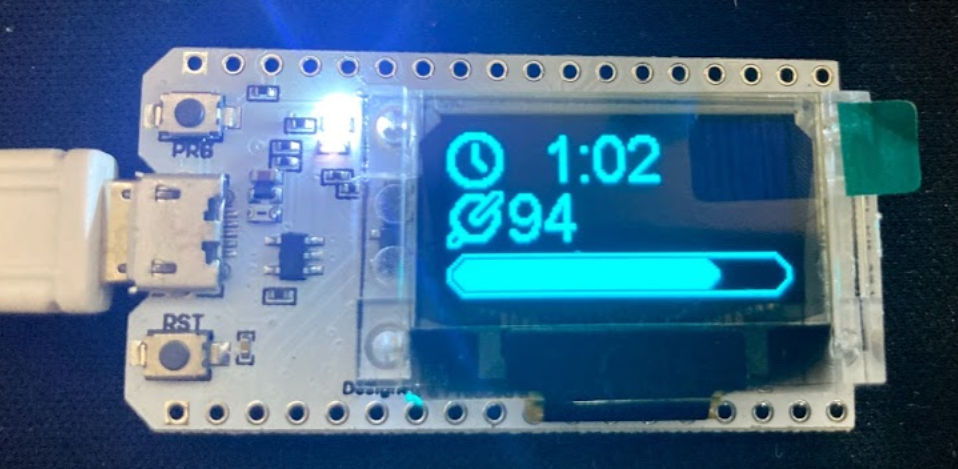

# My Cadence for Arduino

This is an open source project to connect to popular cadence sensors for indoor cycling and display the current cadence in realtime.  Looking for a free cadence display for iOS & Android? Checkout [My Cadence for iOS & Android](https://mycadence.app).

Inspired & code forked from https://github.com/snowzach/echbt, which is an awesome way of dislaying data from an Echelon bike. 

## Hardware Required

* [MarkerFocus ESP32](https://amzn.to/2LAmqt4)
* [ESP32 Batteries(optional)](https://amzn.to/2KGfJWA)
* [USB Micro Cable](https://amzn.to/2KSxstH)

## Compatible Sensors
* [Moofit Cadence](https://amzn.to/349DpZM)
* [Wahoo](https://amzn.to/2KEdC50)
* [Magene](https://amzn.to/3raJ0Jd)
* [Garmin](https://amzn.to/2WtSgdl)

### 3D Printable Case
This is a really nice case that you can print from thingiverse. 
* [caseESP32_OLED on Thingiverse](https://www.thingiverse.com/thing:2670713)

## Setup

1. Install [Arduino Studio](https://www.arduino.cc/en/software)
2. Open .ino in Arduino Studio
3. Add ESP32 Device - [Follow these steps](https://heltec-automation-docs.readthedocs.io/en/latest/esp32/quick_start.html)
4. Select Wifi 32 from Tools -> Board -> Heltec
5. Add ESP32 Library - [Follow these steps](https://github.com/HelTecAutomation/Heltec_ESP32)
6. Add ESP32 BLE Arduino Library - https://github.com/nkolban/ESP32_BLE_Arduino
7. Deploy to device!

The app will automatically scan for cadence sensors for 10 seconds. If it finds a single sensor it will automatically connect and start reporting data! If there are multiple sensors detected you can pick on from the list.

## Get My Cadence for iOS & Android

Looking for an app for your phone or tablet to display the cadence? Checkout [My Cadence](https://mycadence.app), a simple display for your cadence sensor when you are indoor cycling. Simply connect to your cadence sensor via Bluetooth and my cadence will update your cadence in realtime with a simple to read display.

## License information

LICENSE:  This work is licensed under a <a rel="license" href="http://creativecommons.org/licenses/by-nc-sa/4.0/">Creative Commons Attribution-NonCommercial-ShareAlike 4.0 International License</a>.
